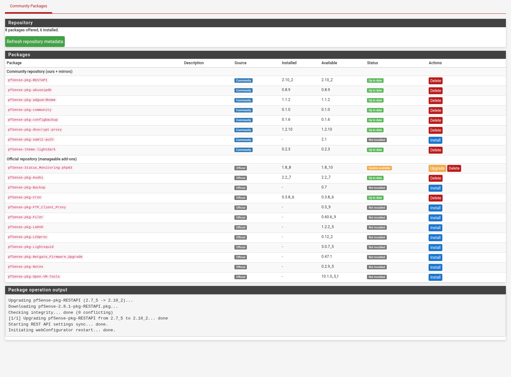

# pfsense-community-packages

[](https://github.com/tmiland-lab/pfsense-community-packages/actions/workflows/mirror.yml)
[](LICENSE)
[](https://www.pfsense.org)
[](https://tmiland-lab.github.io/pfsense-community-packages/)

Unified pkg(8) repository + single-page package manager for community and
mirrored pfSense packages — everything Netgate dropped from (or never put in)
the official repository, plus first-party packages, with **signed repo
metadata** and full upstream provenance.



## What's in the repo

| Package | Source | License |
|---|---|---|
| pfSense-pkg-community (this manager) | first-party | MIT |
| pfSense-pkg-configbackup | [tmiland-lab](https://github.com/tmiland-lab/pfsense-configbackup) | MIT |
| pfSense-pkg-abuseipdb | [tmiland](https://github.com/tmiland/pfsense-abuseipdb) | MIT |
| pfSense-pkg-adguardhome | [tmiland](https://github.com/tmiland/pfsense-adguardhome) | MIT |
| pfSense-pkg-airvpn-remotes | [tmiland-lab](https://github.com/tmiland-lab/pfsense-airvpn-remotes) | MIT |
| pfSense-pkg-vpn-providers | [tmiland-lab](https://github.com/tmiland-lab/pfsense-vpn-providers) | MIT |
| pfSense-theme-lightdark | [tmiland-lab](https://github.com/tmiland-lab/pfsense-theme-lightdark) | MIT |
| pfSense-pkg-ovpn-totp | [tmiland-lab](https://github.com/tmiland-lab/pfsense-ovpn-totp) | MIT |
| pfSense-pkg-RESTAPI | [pfrest](https://github.com/pfrest/pfSense-pkg-RESTAPI) (mirror) | Apache-2.0 |
| pfSense-pkg-saml2-auth | [pfrest](https://github.com/pfrest/pfSense-pkg-saml2-auth) (mirror) | Apache-2.0 |
| pfSense-pkg-dnscrypt-proxy | [nopoz](https://github.com/nopoz/pfsense-dnscrypt-proxy) (mirror) | ISC |
| pfSense-pkg-wgeasy | [MarceloMayo74](https://github.com/MarceloMayo74/pfsense-wgeasy) (mirror) | Apache-2.0 |
| pfSense-pkg-wg-export | [3um3le3ee](https://github.com/3um3le3ee/pfSense-wireguard-peer-export) (mirror) | GPL-3.0 |
| pfSense-pkg-Mullvad | [mmahrous](https://github.com/mmahrous/pfSense-pkg-Mullvad) (mirror) | Apache-2.0 |

Live listing: <https://tmiland-lab.github.io/pfsense-community-packages/>

## Install (pfSense CLI)

```sh
cat > /usr/local/etc/pkg/repos/community.conf <<'EOF'
community: {
    url: "https://tmiland-lab.github.io/pfsense-community-packages/repo",
    mirror_type: "NONE",
    signature_type: "PUBKEY",
    pubkey: "/usr/local/etc/pkg/community.pub",
    enabled: yes
}
EOF
fetch -o /usr/local/etc/pkg/community.pub \
  https://tmiland-lab.github.io/pfsense-community-packages/repo/community.pub
# Check the key against the fingerprint under "Security / audit model" below
sha256 -q /usr/local/etc/pkg/community.pub
pkg update -r community
pkg install -y -r community pfSense-pkg-community
```

Installing the manager package re-installs the repo configuration and trust
anchor on every upgrade, and registers **System → Community Packages** in the
GUI. Simplest path: install the repo conf + pubkey once, then let the manager
handle everything else.

## The manager (System → Community Packages)

One page, every package, inline status:

- **Not installed** → *Install* button
- **Up to date** → *Delete* button
- **Update available** → *Upgrade* + *Delete* buttons
- A *Refresh repository metadata* button (`pkg update -f -r community`)
- The official repository's add-on packages are listed and managed on the
  same page (core system files are excluded and left to pfSense upgrades)
- Package names link to their upstream project repositories (curated
  URLs from `packages/mirrors.json` for community packages; the package's
  declared home page for official ones)
- Packages installed from the community repository are marked `automatic`
  and `vital`, so pfSense's bulk operations (Factory Defaults, *Reinstall
  all packages*) skip them instead of aborting partway through, and
  `pkg autoremove` leaves them alone. Removing one by hand therefore needs
  `pkg delete -f`; the *Delete* button handles it. Packages from the
  official repository are left exactly as pfSense manages them.
- Versions are shown as monospace chips — installed and available side by
  side, with the available version highlighted when an update exists
- **View: Grouped / Flat** — group the list by source repository
  (community first, then official) or switch to a plain alphabetical
  listing; the preference is kept across package actions

Every operation runs `pkg-static` synchronously and shows its output on the
same page. CLI equivalent:

```sh
/usr/local/pfsense-community/bin/community.php list
/usr/local/pfsense-community/bin/community.php install pfSense-pkg-RESTAPI
/usr/local/pfsense-community/bin/community.php delete pfSense-pkg-dnscrypt-proxy
```

## Security / audit model

- **Signed metadata**: the repo metadata is signed (`pkg repo . rsa:`); the
  firewall verifies the embedded signature against the published public key
  (`signature_type: PUBKEY`), same mechanism the official repos use.
- **Mirrored packages** are pinned upstream release assets. Every mirror has
  a provenance entry in `packages/mirrors.json` (upstream URL, version,
  license, expected sha256). Builds **fail hard** on checksum mismatch.
  Where upstream publishes checksums, they are verified before recording;
  where upstream does not (`pfrest`), the recorded hash documents the
  reviewed build and is re-checked at every build.
- **ABI guard**: every staged package is checked against the target ABI at
  build time; mismatches fail the build (see `_excluded` in `mirrors.json`).
  Packages built on a *newer* FreeBSD userland than the target (poudriere's
  `FreeBSD_version` annotation) also fail the build — pkg would otherwise
  reject the whole repository on the firewall.
- **Build provenance**: the manager package is covered by a
  [GitHub artifact attestation](https://docs.github.com/actions/security-guides/using-artifact-attestations-to-establish-provenance-for-builds),
  a Sigstore-signed statement tying those exact bytes to the commit and
  workflow run that produced them. It is independent of the repository
  signing key, so it stays checkable even if that key is lost:

  ```sh
  gh attestation verify pfSense-pkg-community-0.1.4.pkg \
    --repo tmiland-lab/pfsense-community-packages
  ```

  Each manager version is also published as a release asset with its
  sha256. Later refreshes re-publish those same bytes instead of a new
  build, so a version's checksum holds until the version changes, and the
  build fails if the contents drift without a version bump.
- **Trust anchor fingerprint**: the public key that the install steps fetch
  over HTTPS, and that the manager installs, is

  ```
  af462e9b6d23ce80dd83541ddba5a7f51eeb99b1097ec5d2a62f69bd0d785256
  ```

  Recorded here, in git history, as a check on the fetch that does not
  depend on the fetch: `sha256 -q /usr/local/etc/pkg/community.pub` on the
  firewall, `sha256sum community.pub` elsewhere.
- **First-party packages** resolve to the newest build from their own
  repository at build time.
- Mirrors are refreshed daily by
  [.github/workflows/mirror.yml](.github/workflows/mirror.yml) (FreeBSD VM
  runner) or manually: `sh pkg/build.sh` on a pfSense host.

## Adding a package

Add an entry to `packages/mirrors.json` — either `own` (a pkg repository to
resolve the newest version from) or `mirror` (a pinned upstream release asset
+ sha256). Rebuild. Only redistribute what the upstream license permits.

## Uninstall

```sh
pkg remove -y pfSense-pkg-community
```

The menu entry is removed, but the **repo configuration is intentionally
kept** so already-installed community packages can still be upgraded with
`pkg`. Remove `/usr/local/etc/pkg/repos/community.conf` manually if you want
it gone.

## Support

If you find this useful, consider
[sponsoring](https://github.com/sponsors/tmiland) or
[tipping](https://coindrop.to/tmiland) — it keeps the mirrors fresh.

---

Built with [opencode](https://opencode.ai/go?ref=00KNXXSB00) — the open-source
AI coding agent for the terminal. Grab your own at
[opencode.ai/go](https://opencode.ai/go?ref=00KNXXSB00).

## License

MIT — see [LICENSE](LICENSE). Mirrored packages keep their upstream licenses
(see table above); redistribute only what those licenses permit.
